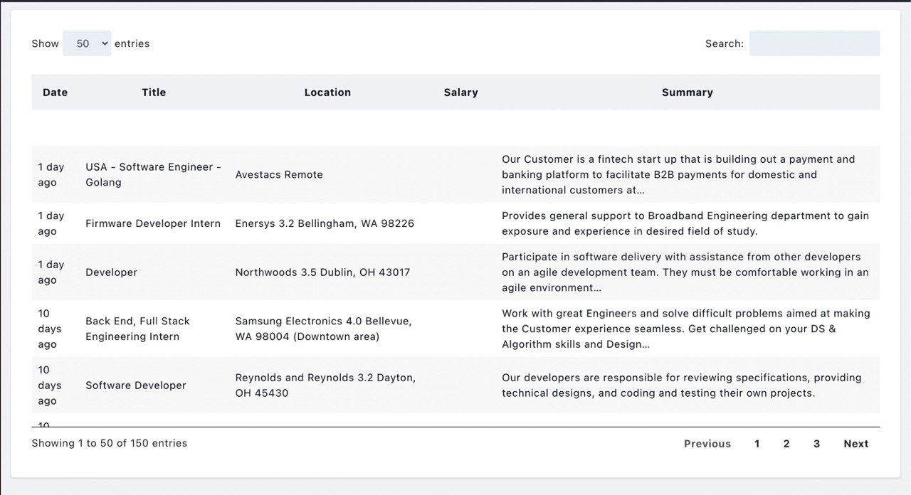

# Job scrapper

Ascii animations are ported from [ascii-live](https://github.com/hugomd/ascii-live)

User input from [bubble tea](https://github.com/charmbracelet/bubbletea)


## Datatable generated with jquery and tailwind css



## Extended job descriptions with links to job postings


Config file format

```yaml
baseurl   : https://www.indeed.com/jobs?
# Amount of jobs returned from each page.
baselimit : &limit=50
# Total amounts of jobs returned
maxresults : 200

jobs:
- job:
  keyword: JobKeyword1 JobKeyword2
  # You can use City ST, zipcode, remote
  # Location is optional
  location:
    - City ST
    - City ST
    - City ST
    - City ST
    - City ST

- job:
  keyword: golang
  location:
    - remote

- job:
  keyword: full stack developer
  location:
    - Austin TX
    - Denver CO
```

## Todos

- [ ] Fix full description formatting
- [x] Config file support
- [x] User Input
- [x] Real nice Ascii animations
